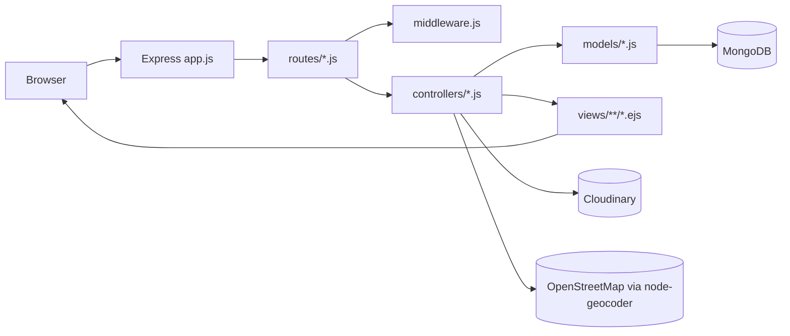
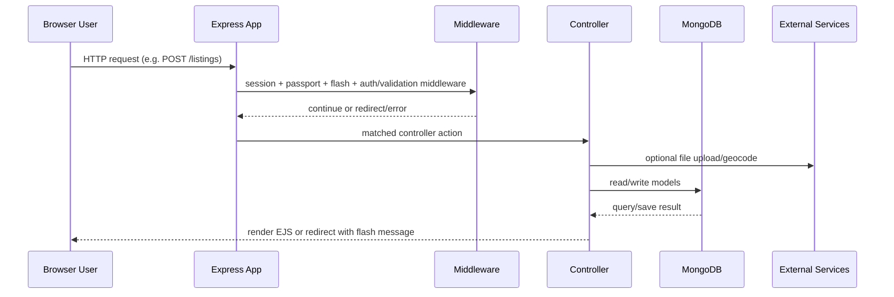

# Wanderlust 🌍✈️

**Travel Around the World**

Wanderlust is a full-stack, server-rendered travel listing platform inspired by Airbnb-style flows. Users can browse listings, sign up/login, create and manage their own listings, upload images, geocode listing locations, and write/delete reviews.

---

## Table of Contents

1. [Project Overview](#project-overview)
2. [Key Features](#key-features)
3. [Complete Tech Stack (and what each does)](#complete-tech-stack-and-what-each-does)
4. [Architecture and Major Modules](#architecture-and-major-modules)
5. [End-to-End Request Lifecycle](#end-to-end-request-lifecycle)
6. [Frontend ↔ Backend Flow](#frontend--backend-flow)
7. [Authentication and Authorization](#authentication-and-authorization)
8. [API and Route Contracts](#api-and-route-contracts)
9. [Database, Models, Validation, Persistence](#database-models-validation-persistence)
10. [Setup and Environment Variables](#setup-and-environment-variables)
11. [Local Development Commands](#local-development-commands)
12. [Deployment and Security Considerations](#deployment-and-security-considerations)
13. [Project Structure](#project-structure)

---

## Project Overview

Wanderlust uses Express + EJS + MongoDB to deliver HTML pages (not a JSON SPA API). The core domain is:
- **Listings**: properties/travel stays with images, owner, price, location, country, and map geometry
- **Users**: local username/password accounts
- **Reviews**: rating + comment linked to listing and author

The app follows a classic MVC pattern:
- **Routes** receive requests
- **Controllers** run business logic
- **Models** persist data with Mongoose
- **Views** render EJS templates for responses

---

## Key Features

- Browse all listings (`/listings`) and open listing details (`/listings/:id`)
- Create, edit, and delete listings (owner-restricted)
- Upload listing images via Multer + Cloudinary
- Geocode listing location/country into coordinates using OpenStreetMap geocoding
- Show listing location on Leaflet maps
- Sign up, login, logout with session-based auth
- Create and delete reviews on listings (review-author restricted on delete)
- Flash messages for success/error UX
- Client-side form validation (Bootstrap validation classes)
- UI tax toggle on listing cards (display-only behavior)

---

## Complete Tech Stack (and what each does)

### Runtime and server
- **Node.js**: JavaScript runtime.
- **Express 5**: HTTP server, routing, middleware pipeline.
- **method-override**: Enables PUT/DELETE from HTML forms via `?_method=`.
- **ejs**: Server-side templating engine.
- **ejs-mate**: Layout support (`layout("layouts/boilerplate")`).

### Database and ODM
- **MongoDB Atlas/local MongoDB**: Primary document database.
- **Mongoose**: Schema definitions, model APIs, population, middleware hooks.

### Validation and error flow
- **Joi**: Request payload validation (`schema.js`) for listing/review form bodies.
- **Custom `ExpressError` + `wrapAsync`**: Structured errors and async error forwarding.

### Authentication, authorization, and sessions
- **passport**: Authentication framework.
- **passport-local**: Username/password strategy.
- **passport-local-mongoose**: Adds `username`, password hashing/salting, and helper methods like `User.register()` / `User.authenticate()`.
- **express-session**: Session middleware with cookie-backed session IDs.
- **connect-mongo**: Stores sessions in MongoDB instead of memory.
- **connect-flash**: One-request flash notifications.

### Uploads and media
- **multer**: Parses multipart file uploads.
- **cloudinary** + **multer-storage-cloudinary**: Cloud image storage and upload adapter.

### Maps and geocoding
- **node-geocoder** (`openstreetmap` provider): Converts listing location text to coordinates.
- **Leaflet (CDN in views)**: Renders map + marker on listing detail page.
- **OpenStreetMap tile layer**: Base map tiles in the browser.

### Frontend UI
- **Bootstrap 5 (CDN)**: Layout/components/forms.
- **Font Awesome (CDN)**: Iconography.
- **Google Fonts (Plus Jakarta Sans)**: Typography.
- **Custom CSS + JS in `public/`**: Styling, form validation, tax-info toggle.

### Utilities / config
- **dotenv**: Loads `.env` in non-production mode.

### Installed but currently not wired in active request flow
- `cookie-session` dependency exists in `package.json`, but active session implementation uses `express-session`.

---

## Architecture and Major Modules



### Major files/directories
- `/app.js` - app bootstrap, DB connect, session/passport setup, routers, error handler
- `/routes` - route declarations for listings, reviews, users
- `/controllers` - request handlers/business logic
- `/models` - `Listing`, `Review`, `User` Mongoose models
- `/middleware.js` - auth guards, owner/author guards, Joi validators, redirect handling
- `/schema.js` - Joi schemas for request validation
- `/cloudConfig.js` - Cloudinary and Multer storage configuration
- `/utils` - geocoder, async wrapper, custom error class
- `/views` - EJS templates (listings, users, layout/includes)
- `/public` - static CSS/JS assets
- `/init` - DB seed script and sample listing dataset

---

## End-to-End Request Lifecycle



Pipeline in `app.js` is: parse body → method override → static files → session store → flash → passport init/session → locals middleware → routers → centralized error renderer.

---

## Frontend ↔ Backend Flow

### Pages and user actions
- **`GET /listings`** (`views/listings/index.ejs`)
  - Shows listing cards.
  - Client-side “Display total after taxes” toggle only shows/hides `+18% GST` text.
- **`GET /listings/new`** (`views/listings/new.ejs`, protected)
  - Multipart form posts listing fields + optional image file.
- **`GET /listings/:id`** (`views/listings/show.ejs`)
  - Shows listing details, reviews, owner actions.
  - If logged in, displays review submission form.
  - Initializes Leaflet map if coordinates exist.
- **`GET /listings/:id/edit`** (`views/listings/edit.ejs`, protected + owner only)
  - Pre-filled form for updating listing and optional image replacement.
- **`GET /signup` / `GET /login`**
  - User auth forms.

### Client-side behavior
- `public/js/script.js` applies Bootstrap validation (`needs-validation`, `was-validated`) and prevents submit if invalid.
- Listing index inline script toggles tax info display.
- Listing show page inline script renders map with coordinate validation/fallback error display.

### Server-side response style
- Primarily server-rendered HTML and redirects.
- Mutation routes typically `req.flash(...)` then `res.redirect(...)`.
- Validation or runtime failures go to `error.ejs` through Express error middleware.

---

## Authentication and Authorization

### Authentication implementation
- Strategy: **Passport Local** (`passport-local`) configured with `User.authenticate()`.
- User model plugin: **passport-local-mongoose** handles password hashing/salting and auth helpers.
- Session persistence: **express-session** + **connect-mongo**.
- Cookies:
  - `httpOnly: true`
  - max age / expiry: 7 days
- Login route uses `passport.authenticate("local", { failureRedirect: '/login', failureFlash: true })`.
- Signup route creates account via `User.register(newUser, password)` and auto-logs user in via `req.login(...)`.
- Logout via `req.logout(...)`.

### Authorization guards
Defined in `middleware.js`:
- `isLoggedIn`: blocks unauthenticated users, stores `req.originalUrl` in session, redirects to `/login`.
- `isOwner`: only listing owner can edit/update/delete a listing.
- `isReviewAuthor`: only review author can delete review.
- `saveRedirectUrl`: restores pre-login target URL after successful login.

### Protected routes
- Listings:
  - `GET /listings/new`
  - `POST /listings`
  - `GET /listings/:id/edit`
  - `PUT /listings/:id`
  - `DELETE /listings/:id`
- Reviews:
  - `POST /listings/:id/reviews`
  - `DELETE /listings/:id/reviews/:reviewId`

---

## API and Route Contracts

> This is an HTML app with form submissions and redirects, not a public JSON API.

### Listings (`routes/listing.js`)

| Method | Path | Purpose | Auth | Body/Params | Typical Response |
|---|---|---|---|---|---|
| GET | `/listings` | List all listings | No | - | Render `listings/index.ejs` |
| GET | `/listings/new` | New listing form | Yes | - | Render `listings/new.ejs` |
| POST | `/listings` | Create listing | Yes | `multipart/form-data` with `listing[title]`, `listing[description]`, `listing[price]`, `listing[location]`, `listing[country]`, file `listing[image]` | Redirect `/listings` |
| GET | `/listings/:id` | Listing detail | No | `:id` | Render `listings/show.ejs` |
| GET | `/listings/:id/edit` | Edit form | Yes + owner | `:id` | Render `listings/edit.ejs` |
| PUT | `/listings/:id` | Update listing | Yes + owner | same fields as create, optional new file | Redirect `/listings/:id` |
| DELETE | `/listings/:id` | Delete listing | Yes + owner | `:id` | Redirect `/listings` |

### Reviews (`routes/review.js`)

| Method | Path | Purpose | Auth | Body/Params | Typical Response |
|---|---|---|---|---|---|
| POST | `/listings/:id/reviews` | Add review to listing | Yes | `review[rating]` (1-5), `review[comment]`, `:id` | Redirect `/listings/:id` |
| DELETE | `/listings/:id/reviews/:reviewId` | Delete review | Yes + review author | `:id`, `:reviewId` | Redirect `/listings/:id` |

### Users/Auth (`routes/user.js`)

| Method | Path | Purpose | Auth | Body | Typical Response |
|---|---|---|---|---|---|
| GET | `/signup` | Signup form | No | - | Render `users/signup.ejs` |
| POST | `/signup` | Register account | No | `username`, `email`, `password` | Redirect `/listings` on success |
| GET | `/login` | Login form | No | - | Render `users/login.ejs` |
| POST | `/login` | Authenticate | No | `username`, `password` | Redirect to stored URL or `/listings` |
| GET | `/logout` | Logout | Yes (meaningful when logged in) | - | Redirect `/listings` |

### External service calls
- **Cloudinary**: receives uploaded listing images through Multer storage engine.
- **OpenStreetMap geocoder**: called on listing create/update to generate `geometry.coordinates`.
- **Leaflet tile layer** in browser: `https://tile.openstreetmap.org/{z}/{x}/{y}.png`.

---

## Database, Models, Validation, Persistence

### Database technology
- **MongoDB** with **Mongoose** ODM.
- Connection URL is from `ATLASDB_URL`.

### Models

#### `User` (`models/user.js`)
- Field: `email` (required)
- Plugin: `passport-local-mongoose` (adds username hash/salt authentication fields and methods)

#### `Listing` (`models/listing.js`)
- `title` (required)
- `description`
- `image: { url, filename }`
- `price`
- `location`
- `country`
- `geometry: { type: 'Point', coordinates: [Number] }` (coordinates required)
- `reviews: [ObjectId -> Review]`
- `owner: ObjectId -> User`
- Post `findOneAndDelete` hook removes associated reviews.

#### `Review` (`models/review.js`)
- `comment`
- `rating` (1..5)
- `createdAt` (default now)
- `author: ObjectId -> User`

### Validation
- Joi schemas in `schema.js` validate:
  - `listing.*` fields (`title`, `description`, `location`, `country`, `price`, optional `image`)
  - `review.*` fields (`rating`, `comment`)
- Middleware throws `ExpressError(400, ...)` on validation failure.

### Persistence flow examples
- **Create listing**: form body + uploaded file → Joi validation → geocode → set `owner`, `image`, `geometry` → `new Listing().save()`.
- **Create review**: validate body → create `Review` with `author` → push review id into listing `reviews` array → save both docs.
- **Delete listing**: `findByIdAndDelete` triggers hook to delete related reviews.

---

## Setup and Environment Variables

Create `.env` in repository root (ignored by `.gitignore`):

```env
ATLASDB_URL=<your-mongodb-connection-string>
SECRET=<session-secret>
CLOUD_NAME=<cloudinary-cloud-name>
CLOUD_API_KEY=<cloudinary-api-key>
CLOUD_API_SECRET=<cloudinary-api-secret>
PORT=8080
NODE_ENV=development
```

### Variable usage
- `ATLASDB_URL`: MongoDB connection + MongoDB session store URL.
- `SECRET`: encrypts/signs session data and connect-mongo crypto.
- `CLOUD_NAME`, `CLOUD_API_KEY`, `CLOUD_API_SECRET`: Cloudinary upload config.
- `PORT`: Express listen port (defaults to `8080`).
- `NODE_ENV`: when not `production`, `dotenv` loads `.env`.

---

## Local Development Commands

### Prerequisites
- Node.js (repo pins engine `22.17.0`)
- npm
- MongoDB Atlas account/cluster (or compatible MongoDB URL)
- Cloudinary account (for image uploads)

### Commands

```bash
git clone https://github.com/anjaliOfficialcoll/Wanderlust.git
cd Wanderlust
npm install
node app.js
```

Open: `http://localhost:8080` (or your configured `PORT`).

### Seed sample listings (optional)

```bash
node init/index.js
```

> `init/index.js` seeds listings into local MongoDB `mongodb://127.0.0.1:27017/Wanderlust` and sets a fixed owner id in seed data.

### Test status
- `npm test` currently maps to a placeholder script and there is no automated test suite configured yet.

---

## Deployment and Security Considerations

Based on current code:

- Sessions are persisted in MongoDB (`connect-mongo`) instead of in-memory store.
- Session cookie is `httpOnly`, reducing JavaScript access in browser.
- Password storage is delegated to `passport-local-mongoose` (hashed+salted, not plaintext).
- Input validation uses Joi before controller persistence for listings/reviews.
- Authorization checks prevent non-owners/non-authors from editing/deleting protected resources.
- `.env` and `node_modules` are gitignored.

Important operational notes:
- `process.env.NODE_TLS_REJECT_UNAUTHORIZED = "0"` is set in `app.js`; this weakens TLS verification and should be removed for hardened production deployments.
- No explicit CSRF middleware is configured.
- Session cookie `secure` and `sameSite` are not explicitly set; configure appropriately behind HTTPS in production.

---

## Project Structure

```text
Wanderlust/
├── app.js
├── cloudConfig.js
├── middleware.js
├── schema.js
├── package.json
├── README.md
├── controllers/
│   ├── listings.js
│   ├── reviews.js
│   └── users.js
├── models/
│   ├── listing.js
│   ├── review.js
│   └── user.js
├── routes/
│   ├── listing.js
│   ├── review.js
│   └── user.js
├── utils/
│   ├── ExpressError.js
│   ├── geocoder.js
│   └── wrapAsync.js
├── views/
│   ├── layouts/boilerplate.ejs
│   ├── includes/{navbar,flash,footer}.ejs
│   ├── listings/{index,new,show,edit}.ejs
│   ├── users/{signup,login}.ejs
│   └── error.ejs
├── public/
│   ├── css/{style,rating}.css
│   └── js/script.js
└── init/
    ├── data.js
    └── index.js
```
