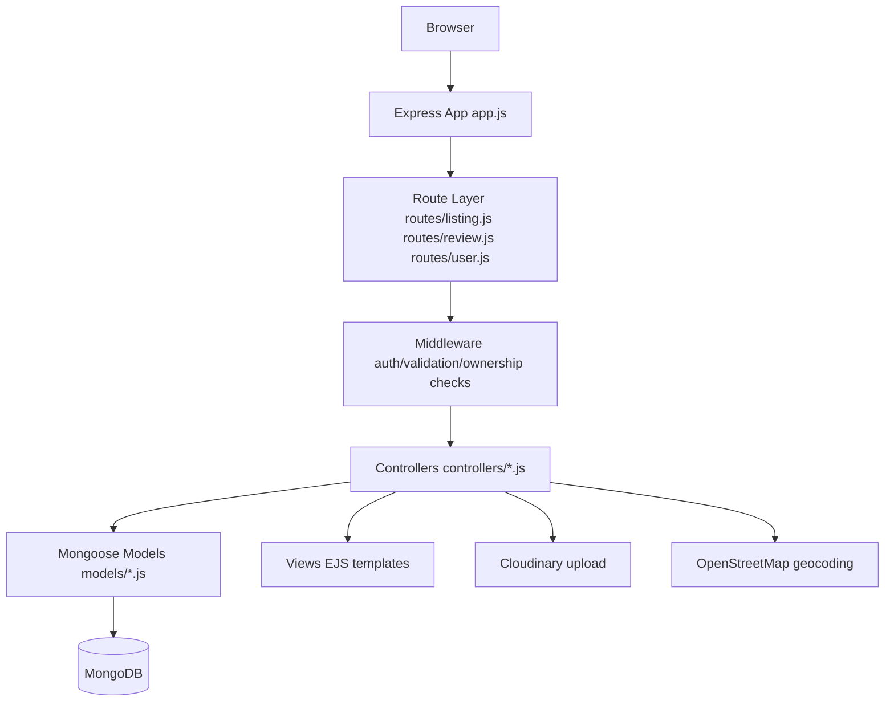
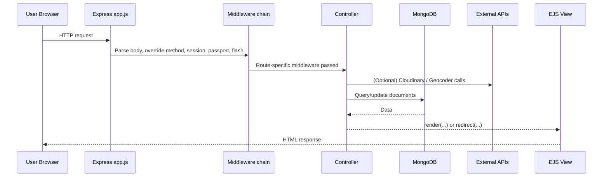

# Wanderlust 🌍✈️

**Travel Around the World**

Wanderlust is a server-rendered travel listing platform inspired by marketplace-style stays apps. Users can sign up, log in, create listings with images, geocode listing locations, browse listings, and leave reviews.

All details in this README are derived from the repository implementation.

## Table of Contents

- [1) Project Overview](#1-project-overview)
- [2) Key Features](#2-key-features)
- [3) Complete Tech Stack and What Each Technology Does](#3-complete-tech-stack-and-what-each-technology-does)
- [4) Architecture and Important Modules](#4-architecture-and-important-modules)
- [5) End-to-End Workflow / Request Lifecycle](#5-end-to-end-workflow--request-lifecycle)
- [6) Frontend ↔ Backend Flow](#6-frontend--backend-flow)
- [7) Authentication and Authorization](#7-authentication-and-authorization)
- [8) API and Route Contracts](#8-api-and-route-contracts)
- [9) Database, Schemas, Relationships, and Persistence Flow](#9-database-schemas-relationships-and-persistence-flow)
- [10) Setup and Local Development](#10-setup-and-local-development)
- [11) Environment Variables](#11-environment-variables)
- [12) Deployment and Runtime Notes](#12-deployment-and-runtime-notes)
- [13) Security Considerations (Code-Grounded)](#13-security-considerations-code-grounded)
- [14) Repository Structure](#14-repository-structure)

## 1) Project Overview

Wanderlust is a monolithic Node.js + Express web app using an MVC-style layout:

- **Views (EJS)** render HTML on the server.
- **Routes** define URL endpoints and middleware chains.
- **Controllers** hold request-handling/business logic.
- **Mongoose models** persist Users, Listings, and Reviews in MongoDB.
- **Session-based authentication** protects listing/review write operations.

The app is not a JSON API-first backend; most routes render templates or redirect with flash messages.

## 2) Key Features

- User signup/login/logout using local username+password auth.
- Session persistence with MongoDB-backed session store.
- Listing CRUD (create/read/update/delete) with owner-based edit/delete controls.
- Listing image upload to Cloudinary via Multer storage adapter.
- Location geocoding (OpenStreetMap provider via node-geocoder) to store coordinates.
- Review create/delete with review-author delete authorization.
- Server-side and request-body validation (Joi + Mongoose constraints).
- Flash success/error messaging and client-side Bootstrap form validation.
- Listing detail page map rendering with Leaflet + OpenStreetMap tiles.

## 3) Complete Tech Stack and What Each Technology Does

### Runtime / Platform

- **Node.js (engine 22.17.0)**: Executes the backend application (`package.json`).

### Backend Framework

- **Express 5**: HTTP server, middleware chaining, route handling (`app.js`, `routes/*`).
- **method-override**: Enables PUT/DELETE via query (`?_method=PUT/DELETE`) from HTML forms.
- **ejs-mate**: Layout support for EJS templates.

### Rendering / UI

- **EJS**: Server-side HTML templates (`views/*`).
- **Bootstrap 5**: UI styles, components, validation UX (loaded via CDN in layout).
- **Font Awesome**: Icons in UI.
- **Leaflet + OpenStreetMap tiles**: Interactive map on listing details.
- **Custom JS/CSS**: Form validation script (`public/js/script.js`) and styling (`public/css/*`).

### Data and Persistence

- **MongoDB + Mongoose**: Document storage and schemas/models (`models/*`).
- **connect-mongo**: Stores express sessions in MongoDB.

### AuthN/AuthZ

- **passport** + **passport-local**: Local strategy authentication.
- **passport-local-mongoose**: User model plugin for hashing/salting + auth helpers.
- **express-session**: Session and cookie management.
- **connect-flash**: One-time success/error messages over redirects.

### Input/Upload/Validation

- **multer**: Parses `multipart/form-data` file uploads.
- **cloudinary** + **multer-storage-cloudinary**: Persist listing images to Cloudinary.
- **joi**: Request payload validation before controller execution.

### External Services / APIs

- **OpenStreetMap geocoding** via `node-geocoder` provider `openstreetmap`.
- **Cloudinary API** for image upload and storage.

> Note: `cookie-session` exists in dependencies but is not used in current app wiring.

## 4) Architecture and Important Modules



Important modules:

- `app.js`: App bootstrap, DB connect, session/passport setup, locals middleware, router mounting.
- `routes/listing.js`: Listing endpoints + upload/authz/validation middleware chain.
- `routes/review.js`: Nested review endpoints under listing.
- `routes/user.js`: Signup/login/logout routes.
- `controllers/listings.js`: Listing CRUD, geocoding integration, map coordinate persistence.
- `controllers/reviews.js`: Review create/delete persistence logic.
- `controllers/users.js`: Signup/login/logout behavior.
- `middleware.js`: Login guard, owner/review-author authorization, Joi validation.
- `schema.js`: Joi schemas for listing/review payloads.
- `models/*.js`: Mongoose schemas and relations.
- `cloudConfig.js`: Cloudinary config + Multer storage adapter.
- `utils/geocoder.js`: Node-geocoder setup using OpenStreetMap provider.

## 5) End-to-End Workflow / Request Lifecycle



Flow details:

1. App starts and loads `.env` when `NODE_ENV !== "production"`.
2. Mongoose connects using `ATLASDB_URL`.
3. Global middleware runs: body parser, method override, static files, session store, flash, passport.
4. `res.locals` gets `success`, `error`, and `currUser` each request.
5. Router dispatches request to listing/review/user modules.
6. Route middleware handles auth/ownership/validation.
7. Controllers perform DB writes/reads and optional Cloudinary/geocoder work.
8. Response is HTML render or redirect with flash messages.
9. Errors bubble to centralized error renderer (`views/error.ejs`).

## 6) Frontend ↔ Backend Flow

- Forms in EJS submit directly to Express endpoints (no Fetch/Axios SPA layer).
- Method override enables REST-like semantics from forms.
- File uploads use `enctype="multipart/form-data"` and field `listing[image]`.
- Backend controllers redirect after writes; flash messages display on next rendered page.
- Listing details page embeds coordinates into inline script for Leaflet map init.

## 7) Authentication and Authorization

### Authentication (who you are)

Implementation:

- `User` schema uses `passport-local-mongoose` plugin.
- Passport local strategy configured with `User.authenticate()`.
- Session support enabled with `passport.initialize()` + `passport.session()`.
- Login route uses `passport.authenticate("local", { failureRedirect: "/login", failureFlash: true })`.
- Signup uses `User.register(newUser, password)`.
- Logout uses `req.logout(...)`.

Credential/session mechanics:

- Password hashing/salting is delegated to `passport-local-mongoose`.
- Session IDs are stored in cookies (`httpOnly: true`) and session data in MongoDB via `connect-mongo`.
- Redirect-after-login is handled by storing `req.session.redirectUrl` in `isLoggedIn` middleware and consuming it in login flow.

### Authorization (what you can do)

- `isLoggedIn`: blocks unauthenticated write actions.
- `isOwner`: only listing owner can edit/delete listing.
- `isReviewAuthor`: only review author can delete that review.

Protected operations include:

- Create/update/delete listings.
- Create/delete reviews.
- Listing edit page.

## 8) API and Route Contracts

> These are web routes returning rendered pages or redirects, not JSON contracts.

### Listing routes (`/listings`)

| Method | Path | Middleware | Request Inputs | Response Behavior |
|---|---|---|---|---|
| GET | `/listings` | - | - | Renders `listings/index.ejs` with all listings |
| GET | `/listings/new` | `isLoggedIn` | - | Renders `listings/new.ejs` |
| POST | `/listings` | `isLoggedIn` → `upload.single("listing[image]")` → `validateListing` | body: `listing[title,description,location,country,price]`; file: `listing[image]` | Creates listing, geocodes location, stores image metadata, redirects to `/listings` |
| GET | `/listings/:id` | - | route param: `id` | Populates owner/reviews/authors; renders `listings/show.ejs` |
| GET | `/listings/:id/edit` | `isLoggedIn` → `isOwner` | route param: `id` | Renders `listings/edit.ejs` |
| PUT | `/listings/:id` | `isLoggedIn` → `isOwner` → `upload.single("listing[image]")` → `validateListing` | same body as create; optional file | Updates listing, optionally replaces image, re-geocodes, redirects `/listings/:id` |
| DELETE | `/listings/:id` | `isLoggedIn` → `isOwner` | route param: `id` | Deletes listing and redirects `/listings` |

### Review routes (`/listings/:id/reviews`)

| Method | Path | Middleware | Request Inputs | Response Behavior |
|---|---|---|---|---|
| POST | `/listings/:id/reviews` | `isLoggedIn` → `validateReview` | body: `review[rating,comment]` | Creates review, attaches to listing, redirects `/listings/:id` |
| DELETE | `/listings/:id/reviews/:reviewId` | `isLoggedIn` → `isReviewAuthor` | route params: `id`, `reviewId` | Removes review ref and document, redirects `/listings/:id` |

### User/auth routes

| Method | Path | Middleware | Request Inputs | Response Behavior |
|---|---|---|---|---|
| GET | `/signup` | - | - | Renders signup form |
| POST | `/signup` | `wrapAsync` | body: `username,email,password` | Registers user, logs in, redirects `/listings` (or redirects back to `/signup` on error) |
| GET | `/login` | - | - | Renders login form |
| POST | `/login` | `saveRedirectUrl` → `passport.authenticate("local", ...)` | body: `username,password` | On success redirects saved URL or `/listings`; on failure redirects `/login` |
| GET | `/logout` | - | - | Logs out user, redirects `/listings` |

### External API usage in request paths

- **Geocoding**: listing create/update calls OpenStreetMap geocoder; coordinates stored in `listing.geometry`.
- **Image upload**: listing create/update uploads to Cloudinary and stores `{url, filename}` in listing doc.

## 9) Database, Schemas, Relationships, and Persistence Flow

### MongoDB collections (via Mongoose models)

#### `User`

- Fields: `email` (required), plus username/hash/salt fields managed by `passport-local-mongoose`.
- Purpose: account identity + authentication.

#### `Listing`

- Core fields: `title` (required), `description`, `price`, `location`, `country`.
- Image object: `{ url, filename }`.
- Geometry: GeoJSON-like `Point` with required numeric `coordinates` (`[lng, lat]`).
- Relations:
  - `owner` → `User` (`ObjectId ref`)
  - `reviews[]` → `Review` references
- Hook: `post("findOneAndDelete")` deletes associated reviews (cascade cleanup).

#### `Review`

- Fields: `comment`, `rating` (1..5), `createdAt`, `author` (`User` ref).

### Validation layers

- **Joi (request layer)**
  - `listingSchema`: requires title/description/location/country/price(min 0).
  - `reviewSchema`: requires rating(1..5) and comment.
- **Mongoose (model layer)**
  - Required fields/types/enums at schema level (e.g., listing title, geometry coordinates).

### Persistence flow examples

- **Create listing**: validate request → upload image → geocode location → build Listing with owner/image/geometry → save.
- **Create review**: validate request → create Review with author → push review ID to Listing.reviews → save both docs.
- **Delete listing**: remove listing → post-delete hook removes related review documents.

## 10) Setup and Local Development

### Prerequisites

- Node.js `22.17.0` (matches `engines.node`)
- npm
- MongoDB Atlas connection string (or compatible MongoDB URI)
- Cloudinary account credentials

### Install

```bash
git clone https://github.com/anjaliOfficialcoll/Wanderlust.git
cd Wanderlust
npm install
```

### Run app

```bash
node app.js
```

Default port is `8080` unless `PORT` is set.

### Optional: seed local sample data

```bash
node init/index.js
```

Seed script currently targets local MongoDB URI `mongodb://127.0.0.1:27017/Wanderlust`.

## 11) Environment Variables

Create `.env` at repository root.

| Variable | Required | Used For |
|---|---|---|
| `NODE_ENV` | Recommended | Controls dotenv loading (loaded when not production) |
| `ATLASDB_URL` | Yes | MongoDB connection URI for app + session store |
| `SECRET` | Yes | Session and connect-mongo crypto secret |
| `PORT` | Optional | App listen port (defaults to 8080) |
| `CLOUD_NAME` | Yes (for uploads) | Cloudinary cloud name |
| `CLOUD_API_KEY` | Yes (for uploads) | Cloudinary API key |
| `CLOUD_API_SECRET` | Yes (for uploads) | Cloudinary API secret |

## 12) Deployment and Runtime Notes

- App boot file: `app.js`.
- Static assets served from `/public`.
- Views served from `/views` with EJS + ejs-mate layout engine.
- Session store depends on MongoDB reachability.
- `package.json` currently has no `start` script; deploy commands should invoke `node app.js` unless scripts are added.

## 13) Security Considerations (Code-Grounded)

Implemented:

- Session cookie set `httpOnly: true`.
- Passport-based authentication guards and owner/author authorization checks.
- Joi request validation for listing/review payloads.
- Session persistence in Mongo store with configured secret.

Important current code considerations:

- `process.env.NODE_TLS_REJECT_UNAUTHORIZED = "0"` disables strict TLS certificate validation at runtime.
- Session cookie does not currently set explicit `secure`/`sameSite` flags.
- No explicit CSRF middleware is configured.
- `saveUninitialized: true` is enabled in session config.

## 14) Repository Structure

```text
Wanderlust/
├── app.js
├── cloudConfig.js
├── middleware.js
├── schema.js
├── controllers/
│   ├── listings.js
│   ├── reviews.js
│   └── users.js
├── models/
│   ├── listing.js
│   ├── review.js
│   └── user.js
├── routes/
│   ├── listing.js
│   ├── review.js
│   └── user.js
├── utils/
│   ├── ExpressError.js
│   ├── geocoder.js
│   └── wrapAsync.js
├── views/
│   ├── layouts/
│   ├── includes/
│   ├── listings/
│   ├── users/
│   └── error.ejs
├── public/
│   ├── css/
│   └── js/
├── init/
│   ├── data.js
│   └── index.js
└── README.md
```

---

If you read this README once, you should be able to explain how Wanderlust is structured, how requests move through the system, how auth/authorization are enforced, how listing/review data persists, and how to run the app locally.
